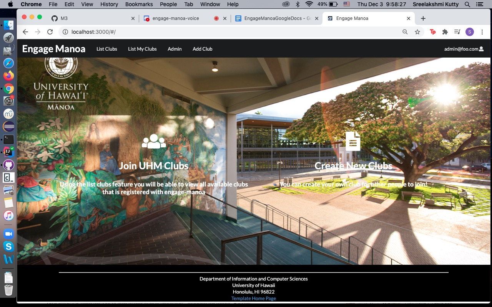

# A Software Developer's Bread and Butter

## Consider the following...

You live in a society in which the only means of transportation is by foot or horseback. One day after lugging bricks for several miles in the heat, you decide there must be another way to transport goods. You notice some kids trying to balance on piece of wood on top a ball, and you realize you could use this as a foundation. You put together a square piece of wood over identical spherical objects... with some modifications (unimportant for this illustration) you have made a simple wagon that can carry objects. At the same time, your friend Philip wonders how he can transport himself and his family with just two horses. Upon seeing your invention and hearing your inspirational story behind its design, he begins by putting together a wooden base over spherical objects. He expands it upwards to make a small carrier that, instead of being pulled by humans, could be pulled by horses. Meanwhile, your other friend, Cam, is trying to figure out how he can move his family too, but unlike Philip, Cam does not have any horses. He wonders if he could develop a contraption that could make this task easier. Upon seeing your invention, he puts together a base on top circular objects and creates a machine that turns that circular objects for him. With some additional modifications, Cam had built a car. Your approach sparks a revolution; platforms on circlular objects take over the world and become the foundation for moving items. Now that people had a basic guideline, there was no need to reinvent the wheel.

## What are design patterns?

<b>"A design pattern provides a general reusable solution for the common problems occurs in software design"</b>
 [Source](https://www.geeksforgeeks.org/design-patterns-set-1-introduction/)

Similar to how Semantic UI assists in web/app development, design patterns foster efficiency for software development. However, design patterns provide protocols for how to approach certain problems instead of offering specific solutions (although that can be a side effect). Software developers oftern encounter similar issues across the board, meaning regardless of what the product may be, issues that are akin to one another, are inevitable. It is for this reason, software developers greatly favour the use of design patterns as it assists in constructing solutions that are "flexible, reusable, and maintainable". Design patterns are in no way mandatory and are simply general ideas that can be manipulated to suit a project's needs. Even a simple essay template or website layout can be considered design patterns. In this way, one can see how basic and essential design patterns can be for software developing, as it simplifies tasks to more doable sections as opposed to a slurry of chaos.

## Design patterns I have used in my code

The most specific example of a design pattern I have recently used in coding is for my ICS 314 Final Project. For this project, my partners and I have been entasked to create an app that allows users to find campus clubs and specific ones to their personal list. Entitled "Engage Manoa", this web app is based off a previous homework project, "Digits". Aside from the more obvious structuring and layout of the website, the associated data has also been stored in a schema identical to the one previously used. By using the same data structure, we only had to make minor adjustments to fields, ultimately saving a tremendous amount of time.

