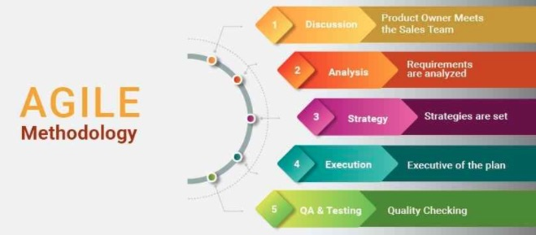

# It's more than just 1s and 0s

## A Compounded Experience

During my brief experience with software engineering, I realized that the gield involves far more than just coding. While I learned the language Javascript and strengthened my knowledge in HTML/CSS, the most important personal lessons were not even about coding skills. In addition to learning how to use UI frameworks (UI Semantic and React), I delved into the world of software development and the tools used to do so. Two of these tools had a profound impact--development environments and agile project management.

## Development Environments

When I first delved into the world of computer science and programming, I had no idea what one needed to create a program. My first ever programming assingment was to download a software called "Alice", and truth be told, I was incredibly confused as to why I would need this strange program. I was instructred to move blocks labelled with "if/else", "for", etc--basic functions that we built upon to create methods, objects, and so forth. However, I still did not understand how one would develop a software program by writing lines of code; after all, computer science was just about writing gibberish and spitting out some cool product, right? After a brief stint with "MIT Scratch", I finally approached a program called "Processing" in which I attempted line-by-line coding for the first time. I was surprised that the concept was the same as dragging blocks to create code. The only real difference was I was writing the code myself. I then reflected on "Alice" and how we could make different segments that called on other segments that called on other segments... esentially creating cohesive methods and functions. Alice was my first love affair with development environments, and it shaped my understanding of how software engineering works. Alice, MIT Scratch, and Processing were just different offices with specific layouts and tools that could create all sorts of projects.

My journey through computer science has since taken me to other offices--drJava, Eclipse, IntelliJ, and the simplest of all, VI. In each case, it was like entering a brand new work space that had a desk and cabinets filled with a plethora of tools. It is important to note that some offices are better for certain projects. You wouldn't want to use an office that was designed to offer appliances to harvest organs when you want to make clay sculpture. Alice and IntelliJ are exmaples of "integrated development environments" (IDEs). IDEs enable "programmers to consolidate the different aspects of writing a computer program" and "increase programmer productivity by combining common activities of writing software into a single application..". IDEs foster efficiency and provide three basic facilities: 1) source code editor, 2) debugger, and 3) creating executables. The first function is straightforward--a space to write the instructions on what our project should do and how it should be built. Secondly, we have a tool similar to "spell-check" that helps us find problems in our code. For example, Eclipse's debugger can allow one to go through each line while displaying exactly what's happening; you have the option to "step into" functions to see what a particular method is actually doing, and in doing so, catch errors we could not see otherwise. IntelliJ can utilize a system called ESLint that offers an additional element of debugging that aids in eliminating simple syntax errors to structural issues. Thirdly, IDEs grant us the ability to "create executables", which is simply the file or object that can be run to execute the instructions we have written. [s1]

IDEs are what make things like website development and application development intricate and complex. Instead of visiting painfully bland websites that have neon, Comic Sans font over a bright background, we can see beautifully built masterpieces made by people who may not even be software engineers. Development Environments provide a platform for projects that involve extensive database structures and allow us to handle a variety of components in one work space. Their versatility enables software engineers to create projects that extend beyond just application and website development. Utlimately, development environments, and especially integrated development environments, are what make bolster the success of software engineering.

<b>If you would like to see more information regarding some of the development environments mentioned above, please visit the links provided.</b>

Environments for block coding: [Alice](https://www.alice.org/), [MIT Scratch](https://scratch.mit.edu/)

Beginning line-by-line coding: [Processing](https://processing.org/download/)

IDEs geared towards Java: [drJava](http://www.drjava.org/), [Eclipse](https://www.eclipse.org/ide/)

IDEs geared towards web developemt and application building: [Sublime Text](https://www.sublimetext.com/), [IntelliJ](https://www.jetbrains.com/idea/) 

## Agile Project Management

I am no newbie to team projects, but when it comes to software development, working with a team is certainly still fresh. In a recent experience, I was able to develop a basic website application with three other peers and ultimately learn a new team work strategy that is paramount for software developers--agile project management. This strategy involves a straightforward methodology (as shown in the graphic below), which enables team projects to efficiently lay out tasks with deadlines.

<b>According to the "Agile Manifesto" there are 12 Principles:</b>

1. There should be continuous delivery of valuable software to achieve higher levels of customer satisfaction as it is the top priority.

2. It is possible to accommodate changes in the requirements even in the later phases of development.

3. Deliver working software more frequently in a shorter time span.

4. Daily collaboration among the business team and developers is must for the success of the project.

5. Team members should have greater autonomy with greater support and trust.

6. For conveying information to the development team, face-to-face interaction is a must.

7. The working software can be the measure of the project’s progress.

8. There should be a constant pace of development indefinitely to promote sustainable development.

9. The main focus is on good design and technical excellence.

10. Progress is dependent on simplicity.

11. To achieve the best possible architecture and designs, self-organizing teams are required.

12. The teams should focus on continuous improvement and should be able to adapt to changes for greater effectiveness.

For this project, we utilized a particular form of agile project management called issue driven project management. In this case, our work was broken down to a list of issues that team members could assign to others or themselves. So as to minimize chaos and confusion, it was important that a team member only work on one issue at a time. Once an issue is completed, it is moved to a separate list and "closed", indicating that the task can be reviewed. GitHub provides a space for team projects to create three columns: 1) a list of all the initial tasks 2) a list where team members "claim" issues to work on and 3) a list to move completed issues. When working on a particular issue, team members can create new branches and work on their local desktops, using their development environments. This approach is a driving force behind software development and is even something I have seen my father, a software engineer, use a on a daily basis. What I find most impactful from this experience is that this strategy is applicable beyond the world of software development, and I can honestly say that I plan on utilizing this approach in other team based projects. [s2]

<h3>Sources</h3>
Source 1: [s1](https://www.codecademy.com/articles/what-is-an-ide) 
Source 2: [s2](https://reqtest.com/agile-blog/agile-methodology-tutorial/)

