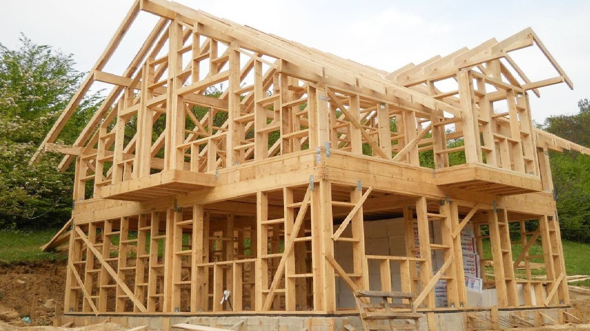

# Why Reinvent the Wheel?

## Taking a look back...
My first experience with web designing was junior year of highschool, nearly five years ago. While in the midst of learning Java, I decided to dabble with HTML and CSS. At first it seemed like the most simple thing--just put some tags here and there with some formatting and voila you have yourself some code! I eventually created a website by adjusting the source code in a premade template from [Weebly](https://www.weebly.com/). During that experience I realized that writing a few lines of code would not render a beautiful layout with perfect margins and borders. But it was not until I tried making a whole website from scratch that I realized how tedious it all is. An opportunity popped up in senior year to try and design a website for the Foster Botanical Gardens in downtown Honoulu. My project partner and I decided to first look at some premade website templates on common sites such as Weebly and Wix, but the options were so limited, so controlling the features were far too difficult. I decided, why not just try make it from scratch? The number of hours spent to try create a simple website with a menu bar, an internactive map, and event schedule proved to be far more arduous than I first imagined. Needless to say, the project did not get completed (thankfully it was not a serious business project), and the only lesson I learned was that making a website with just HTML and CSS is truly ineffecient. Enter UI Semantic..

## Building a House

Creating a website is like building. You can choose the ready made ones and just add your own furniture; you can buy a simple one and make extensive interior updates; or you can even build a whole new one from scratch. While there is not right or wrong approach to building a house from scratch, there can be strategies that are more efficient than others. Building from scratch does not mean every single element needs to be constructed when there are already micro-templates and pieces that can be applied. Why cut down a tree, soften the wood, shape it into strips, sand it down, etc, when you can just purchase those parts? In the same way, why would we spend time trying to create nice margins and text alignments by manipulating individual pixels through CSS when UI Semantic offers a variety of commands that can do just that?

## section 3

After having dealt the atrocity that is HTML/CSS, using UI Semantic was a welcomed experience. Being able to apply tags that were built to streamline the process of web development was absolutely delightful. 

