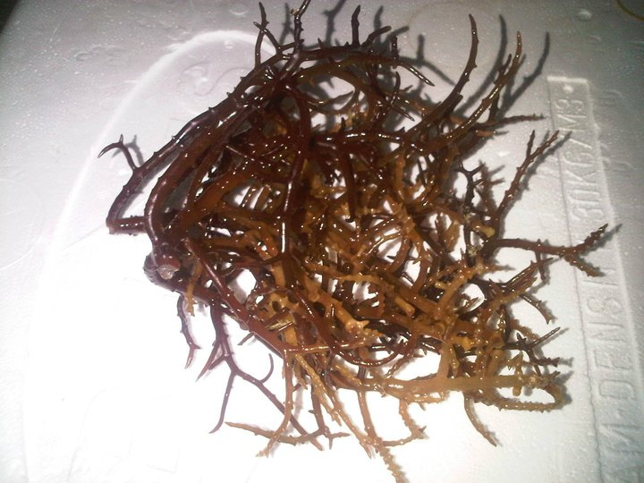
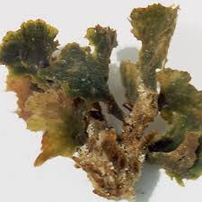

<h3>Project Developers:</h3>

Jun Ho Im, Mikel Ishihara, Christian Pak, Sreelakshmi Kutty

[Engage Manoa Project Page](https://engage-manoa.github.io/)

## Significance and Solution

The University of Hawaii at Manoa offers a multitude of clubs and organizations that are student led and operated. Each semester a festive club drive takes place at the well-known Campus Center, giving these groups a chance to advertise their activities and garner interest.

## Development

words go here

## Team work makes the dream work

words god here

<b> Competed at the 2015 and 2016 INTEL International Science and Engineering Fair, earning 3rd place in Chemistry and 2nd place in Environmental Engineering respectively. </b> 

